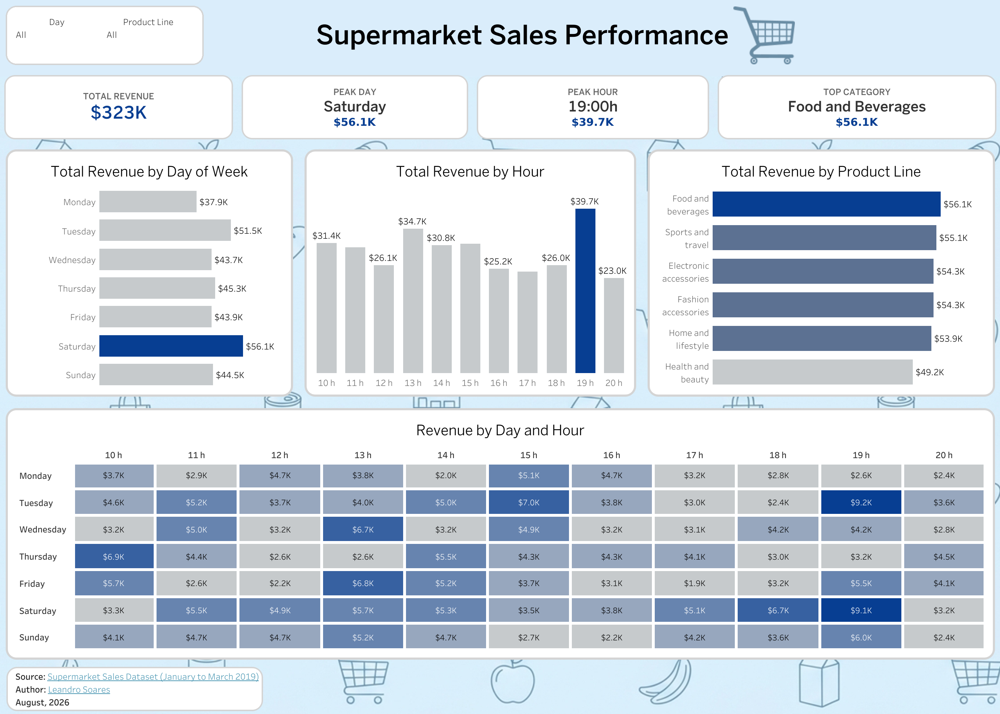

# Supermarket Sales Performance Analysis

An end-to-end data analytics project analyzing supermarket sales performance. The pipeline includes **data cleaning and preprocessing in Python**, **exploratory data analysis (EDA) using Matplotlib/Seaborn**, **data aggregations via SQL**, and an **interactive executive dashboard in Tableau**.

---

## 📌 Executive Summary

The primary objective of this project is to analyze transaction records from a supermarket chain to identify key revenue drivers, purchasing trends across days and hours, and top-performing product lines. 

By comparing analytical results between **SQL** and **Python**, the analysis was validated before building the final visualization layer in **Tableau**.

* **Dataset Source:** [Supermarket Sales on Kaggle](https://www.kaggle.com/datasets/faresashraf1001/supermarket-sales/data)

---

## 📊 Key Performance Indicators (KPIs)

* **Total Revenue:** `$323K`
* **Peak Sales Day:** `Saturday` (`$56.1K`)
* **Peak Sales Hour:** `19:00 h` (`$39.7K`)
* **Top Product Line:** `Food and Beverages` (`$56.1K`)

---

## 🛠️ Project Workflow & Tech Stack

| Phase | Tool / Library | Description |
| :--- | :--- | :--- |
| **1. Data Cleaning** | `Python` (Pandas, NumPy) | Handled missing values, formatted timestamps, extracted temporal features (`Hour`, `Day_Name`), and standardized categorical data. |
| **2. Exploratory Data Analysis** | `Python` (Matplotlib, Seaborn) | Generated bar plots and revenue heatmaps to explore sales distributions across days and time slots. |
| **3. Analytical Aggregations** | `SQL` | Structured relational queries to compute KPI metrics, group revenue by product categories, and build day-by-hour cross-tabulations. |
| **4. Visualization Layer** | `Tableau Desktop` | Designed a dynamic executive dashboard featuring interactive filters (`Day`, `Product Line`) and custom color palettes for operational insights. |

---

## 🖼️ Dashboard Preview

---

👤 Author: Leandro Soares: [LinkedIn Profile](https://www.linkedin.com/in/leandro-soares-91912097/)
